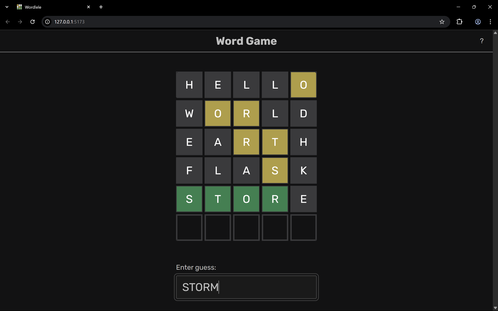
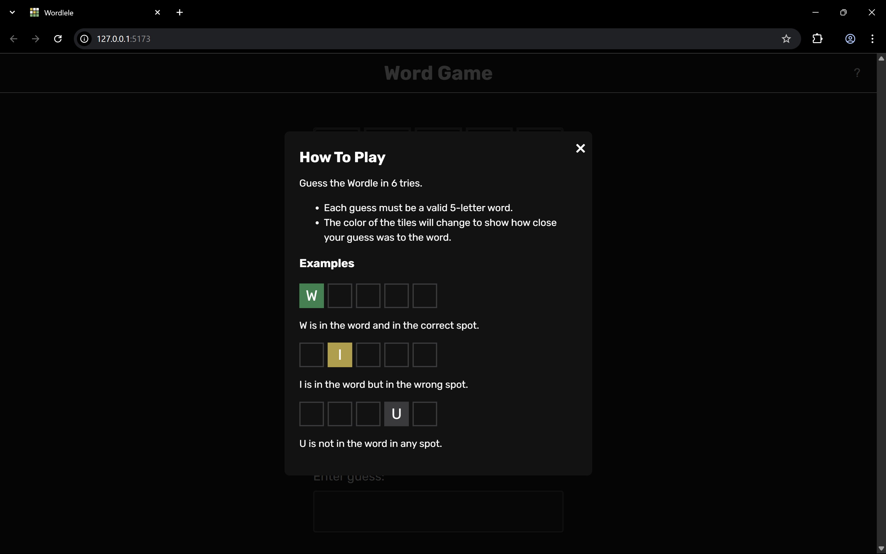

# Verdle - Wordle Clone

[Verdle](https://verdle.netlify.app) is a Wordle-inspired word guessing game built with React.

## Why "Verdle"?

The name "Verdle" is a playful twist on "Wordle." "Ver" means "green" in French, referencing the color used to indicate correct letters in the game.

## Screenshots

### Game Interface

### How to Play

## Play Online

Try it now: [verdle.netlify.app](https://verdle.netlify.app)

